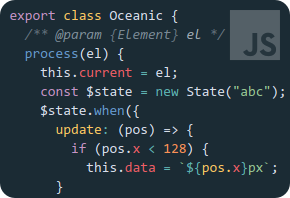
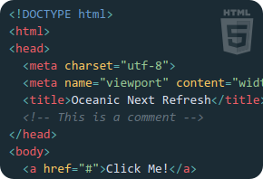
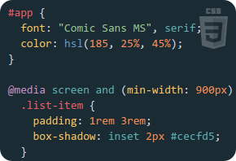
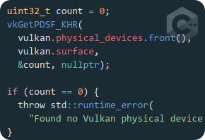

# Oceanic Next Refresh


A syntax theme for [Atom](https://github.com/atom/atom), inspired by the lovely
[oceanic-next](https://github.com/smlombardi/oceanic-next-syntax) – with extensibility in mind.






See also: original [Oceanic Next](https://labs.voronianski.com/oceanic-next-color-scheme/) theme.

## Installation

```
apm install oceanic-next-refresh-syntax
```

## Contributing

For feedback and requests, please use the Issue tracker. If you want better highlighting for your
language of choice, please include code samples if possible; the more syntax, the better!
